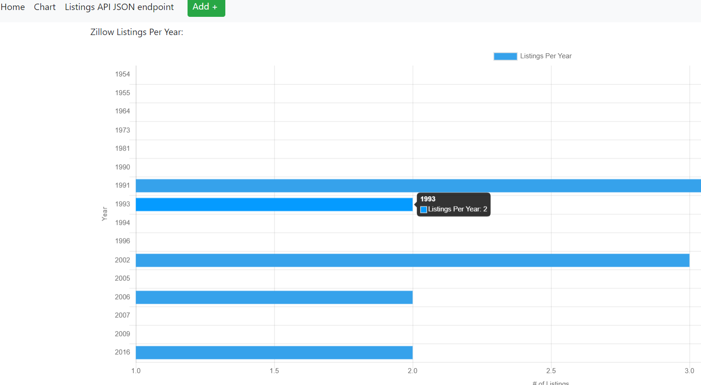

# FinalTeamProject

For this project, you need to research and develop one unique feature per team member and integrate it into the application that you have been making in the previous homework web application project.  I am not providing any resources for this team project other than the list of 3 possible options for your project.  The objective of this is for you to work with your team to plan, develop, and integrate your features together in a final project.  Each persons work should be easily visible on the site and the site should be organized thoughtfully and cohesively i.e. not just random stuff thrown together.  Come up with a concept for your application that uses these three features, or you can propose a different feature to the professor for approval.  Generally I will approve anything that is of similar difficulty to the options below

Chosen Project features 

## Lauren Rega:
1.  Use the statistics project to create API endpoints and then consume those endpoints using a JavaScript chart selected from the ones listed in this article here (Links to an external site.).

## Sally Khalil
2.  Create a login and registration process that includes email verification.  You can use a service like SendGrid to send email and you should look for a Flask Plugin to help.

## Feature 1:

Lauren used this tutorial to implement feature 1: [tutorial link](https://css-tricks.com/the-many-ways-of-getting-data-into-charts/)

- The chart she generated displays the number of listings posted per year from a Zillow table.
  
  
- This is the data that flows into the chart:

  
- You can add a new listing here:

  
- The new listing will show up on the chart:

  
- You can also delete a listing if need be:

  
- The chart will update again:
